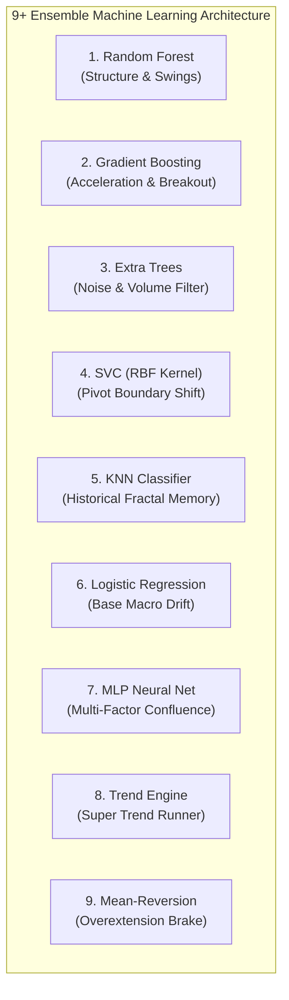

# 📊 การวิเคราะห์พฤติกรรมราคาเชิงลึก: 9+ Ensemble Machine Learning Models
## AI Gold Scalper — Price Action & Ensemble Dynamics Manual (XAU/USD)

> **เอกสารอ้างอิงทางเทคนิค:** อธิบายลักษณะการวิ่งของราคา (Price Action Characteristics) ที่แต่ละอัลกอริทึมในระบบ 9+ Ensemble ตรวจจับได้ และการสังเคราะห์ผลลัพธ์ร่วมกันผ่านกลไก Consensus, Market Regime, Kaufman Efficiency Ratio (KER) และ Safety Interceptors

---

## 📑 สารบัญ
1. [ภาพรวมของระบบและฟีเจอร์นำเข้า (Feature Ingestion)](#1-ภาพรวมของระบบและฟีเจอร์นำเข้า)
2. [การวิเคราะห์เจาะลึก 9 อัลกอริทึมกับการตรวจจับพฤติกรรมราคา](#2-การวิเคราะห์เจาะลึก-9-อัลกอริทึมกับการตรวจจับพฤติกรรมราคา)
   - [1. Random Forest Classifier](#1-random-forest-classifier-ensemble-trees--bagging)
   - [2. Gradient Boosting Classifier](#2-gradient-boosting-classifier-boosting--error-minimization)
   - [3. Extra Trees Classifier](#3-extra-trees-classifier-extremely-randomized-trees)
   - [4. Support Vector Classifier (SVC)](#4-support-vector-classifier-svc--rbf-kernel)
   - [5. K-Nearest Neighbors (KNN)](#5-k-nearest-neighbors-knn--distance-based-memory)
   - [6. Logistic Regression](#6-logistic-regression-linear-probabilistic-baseline)
   - [7. Multi-Layer Perceptron (MLP Neural Network)](#7-multi-layer-perceptron-mlp-neural-network)
   - [8. Gold Trend-Following Engine](#8-gold-trend-following-engine-rule-based-expert)
   - [9. Gold Mean-Reversion Engine](#9-gold-mean-reversion-engine-pullback--knife-guard)
3. [ตารางเปรียบเทียบมุมมองพฤติกรรมราคาของทั้ง 9 อัลกอริทึม](#3-ตารางเปรียบเทียบมุมมองพฤติกรรมราคาของทั้ง-9-อัลกอริทึม)
4. [กลไกการสังเคราะห์ร่วมกัน (Ensemble Consensus & Safety Architecture)](#4-กลไกการสังเคราะห์ร่วมกัน-ensemble-consensus--safety-architecture)
5. [ลักษณะการวิ่งของราคาที่ผ่านการอนุมัติสุดท้าย (The Emergent Price Action Profile)](#5-ลักษณะการวิ่งของราคาที่ผ่านการอนุมัติสุดท้าย-the-emergent-price-action-profile)
6. [แนวทางการนำไปใช้งานจริงสำหรับ Day Trader (Trader Execution Guide)](#6-แนวทางการนำไปใช้งานจริงสำหรับ-day-trader)

---

## 1. ภาพรวมของระบบและฟีเจอร์นำเข้า

ในระบบ [ai_engine.py](file:///c:/MQL5-Vibe-Coding/AI-Gold-Scalper-Dashboard/core/ai_engine.py) ข้อมูลราคาของทองคำ (XAU/USD) จะถูกสกัดออกมาเป็นชุดตัวแปรทางสถิติและเทคนิค (Quantitative Technical Features) 12 ตัว ก่อนส่งเข้าโมเดลทั้ง 9 ตัว:

```text
┌────────────────────────────────────────────────────────────────────────────────────────┐
│                        ชุดข้อมูลฟีเจอร์ที่ป้อนเข้าโมเดล (Features Ingestion)            │
├──────────────────────┬─────────────────────────────────┬───────────────────────────────┤
│ โมเมนตัมและความเร็ว  │ RSI (14 & 7), MACD Difference   │ mom_3, mom_5 (Normalized ATR) │
├──────────────────────┼─────────────────────────────────┼───────────────────────────────┤
│ โครงสร้างและแนวโน้ม  │ EMA Spread ((EMA9-EMA21)/ATR)   │ Stochastic %K (14, 3)         │
├──────────────────────┼─────────────────────────────────┼───────────────────────────────┤
│ ความผันผวนและขอบเขต  │ Bollinger Bands Pos (bb_pos)    │ ATR (Average True Range 14)   │
├──────────────────────┼─────────────────────────────────┼───────────────────────────────┤
│ กายวิภาคแท่งเทียน    │ candle_body, upper/lower_shadow │ vol_ratio (Volume vs 20-MA)   │
└──────────────────────┴─────────────────────────────────┴───────────────────────────────┘
```

---

## 2. การวิเคราะห์เจาะลึก 9 อัลกอริทึมกับการตรวจจับพฤติกรรมราคา



---

### 1. Random Forest Classifier (Ensemble Trees — Bagging)
* **กลไกการทำงาน:** สร้างต้นไม้ตัดสินใจ (Decision Trees) จำนวนมากที่สุ่มเลือกชุดฟีเจอร์ เพื่อลดความแปรปรวน (Reduce Variance)
* **ลักษณะการวิ่งของราคาที่ตรวจจับ:** **"โครงสร้างสวิงที่เป็นระเบียบ (Structured Swings & Swing High / Swing Low)"**
* **พฤติกรรมบนกราฟแท่งเทียน:**
  - ตรวจจับแท่งเทียนที่วิ่งอย่างมั่นคงต่อเนื่อง ไม่ผันผวนสะบัดหลอก
  - มองหารูปแบบที่หลายปัจจัยยืนยันพร้อมกัน เช่น EMA ค่อยๆ ถ่างออก + เนื้อเทียนมีทิศทางสม่ำเสมอ
  - **จุดเด่นบนทองคำ:** ไม่หวั่นไหวกับแท่งสะบัดทิ้งไส้หลอกเพียง 1–2 แท่ง (High Noise Tolerance)

---

### 2. Gradient Boosting Classifier (Boosting — Error Minimization)
* **กลไกการทำงาน:** เทรนต้นไม้แบบลำดับขั้น โดยต้นไม้ถัดไปจะมุ่งเน้นแก้ไขจุดผิดพลาดของต้นไม้ก่อนหน้า ทำให้ตอบสนองต่อ "ความชันและอัตราเร่ง" สูงมาก
* **ลักษณะการวิ่งของราคาที่ตรวจจับ:** **"การระเบิดตัวของโมเมนตัมและการทะลุกรอบ (Momentum Acceleration & Breakout Expansion)"**
* **พฤติกรรมบนกราฟแท่งเทียน:**
  - ตรวจจับแท่งเทียนประเภท **Impulse Candle** ที่ลำตัวยาวผิดปกติ (`candle_body` กว้างขึ้น)
  - ตรวจจับค่า `mom_3` และ `mom_5` ที่พุ่งขึ้นอย่างรวดเร็ว และ MACD Diff เริ่มถ่างออกเฉียบพลัน
  - **จุดเด่นบนทองคำ:** จับจังหวะที่ราคากำลังหลุดจากจุดสะสมแล้ว "วิ่งติดสปีด" ได้แม่นยำมาก

---

### 3. Extra Trees Classifier (Extremely Randomized Trees)
* **กลไกการทำงาน:** สุ่มทั้งฟีเจอร์และจุดตัด (Cut-point Threshold) อย่างเข้มงวด ป้องกันการจำข้อสอบ (Overfitting)
* **ลักษณะการวิ่งของราคาที่ตรวจจับ:** **"การเคลื่อนที่ที่มี Volume จริงหนุนหลัง (Volume-Backed Clean Moves)"**
* **พฤติกรรมบนกราฟแท่งเทียน:**
  - ทำหน้าที่เป็น **Noise & Fakeout Filter**
  - หากราคาวิ่งขึ้นหรือลงแต่มีแต่ไส้เทียนยาว (`upper/lower shadow`) หรือวอลุ่มแห้งแล้ง (`vol_ratio` ต่ำ) Extra Trees จะปัดตกเป็นสัญญาณหลอก
  - **จุดเด่นบนทองคำ:** ช่วยคัดกรองแท่งเทียนที่เป็น False Breakout ในช่วงตลาดเอเชียหรือช่วงสภาพคล่องต่ำ

---

### 4. Support Vector Classifier: SVC (RBF Kernel)
* **กลไกการทำงาน:** แปลงชุดข้อมูลที่ไม่เป็นเส้นตรงไปสู่มิติสูง (High-Dimensional Hyperplane) เพื่อสร้างขอบแบ่งแยก (Maximum Margin)
* **ลักษณะการวิ่งของราคาที่ตรวจจับ:** **"จุดตัดเปลี่ยนระนาบโครงสร้างราคา (Structural Boundary Shift / Pivot Break)"**
* **พฤติกรรมบนกราฟแท่งเทียน:**
  - ตรวจจับจังหวะที่ราคาหลุดออกจากความสมดุลเดิม (Equilibrium Boundary)
  - เช่น ราคาที่บีบอัดใน Bollinger Bands แล้วเริ่มเปิดปิดแท่งหลุดขอบ พร้อมกับ RSI ทะลุระดับ 50 ขึ้นมา
  - **จุดเด่นบนทองคำ:** ตรวจจับ "รอยต่อ" ของการเปลี่ยนผ่านจากสภาวะไซด์เวย์ไปเป็นแนวโน้มใหม่

---

### 5. K-Nearest Neighbors: KNN (Distance-Based Memory)
* **กลไกการทำงาน:** ค้นหาประวัติศาสตร์แท่งเทียนในอดีต (History Replay) ที่มีเวกเตอร์อินดิเคเตอร์ใกล้เคียงกับแท่งปัจจุบันมากที่สุด (7 ตัวอย่างที่ใกล้ที่สุด)
* **ลักษณะการวิ่งของราคาที่ตรวจจับ:** **"พฤติกรรมราคาที่เกิดซ้ำตามสถิติในอดีต (Historical Fractals & Chart Patterns)"**
* **พฤติกรรมบนกราฟแท่งเทียน:**
  - เป็นโมเดลที่เปรียบเหมือน "ความทรงจำสถิติของทองคำ"
  - ตรวจจับว่า: *“หากราคาทิ้งไส้ล่างยาว 40% + Stochastic ตัดขึ้นต่ำกว่า 20 + EMA เรียงตัวแบบนี้ ในอดีตแท่งต่อๆ ไปราคามักดีดกลับขึ้นไปได้ $\ge 1.0 \times \text{ATR}$”*
  - **จุดเด่นบนทองคำ:** จดจำพฤติกรรมเฉพาะตัวของราคาทองคำ เช่น การเคลียร์สภาพคล่อง (Liquidity Sweep) แล้วดีดกลับ

---

### 6. Logistic Regression (Linear Probabilistic Baseline)
* **กลไกการทำงาน:** คำนวณความน่าจะเป็นเชิงเส้นถ่วงน้ำหนักจากผลรวมของปัจจัยทั้งหมด (Linear Baseline)
* **ลักษณะการวิ่งของราคาที่ตรวจจับ:** **"ทิศทางลมหลักที่มีความสม่ำเสมอ (Steady Directional Drift / Macro Momentum)"**
* **พฤติกรรมบนกราฟแท่งเทียน:**
  - เป็นตัวควบคุมสมดุลความมีเหตุผล (Sanity Check)
  - ไม่สนใจการกระชากวูบวาบสั้นๆ แต่จะมองว่าภาพรวม (EMA Slope, RSI, MACD) ให้น้ำหนักเอนเอียงไปฝั่งใดมากกว่า
  - **จุดเด่นบนทองคำ:** ป้องกันการเปลี่ยนใจสลับข้างไปมาตามการสวิงสั้นๆ ของแท่งเทียน

---

### 7. Multi-Layer Perceptron: MLP (Neural Network)
* **กลไกการทำงาน:** โครงข่ายประสาทเทียม 2 ชั้นซ่อน (32, 16 Nodes) วิเคราะห์ความสัมพันธ์ที่ซับซ้อนทับซ้อนกันแบบ Non-linear
* **ลักษณะการวิ่งของราคาที่ตรวจจับ:** **"จุดบรรจบหลายเงื่อนไขที่มองไม่เห็นเดี่ยวๆ (Complex Multi-Factor Confluence)"**
* **พฤติกรรมบนกราฟแท่งเทียน:**
  - มองหาจุดที่ตัวชี้วัดตัวเดียวตอบไม่ได้ เช่น RSI ยังไม่ Overbought แต่ไส้เทียนล่างถูกปฏิเสธ ร่วมกับองศาของเส้น EMA และวอลุ่มเริ่มไหลเข้า
  - **จุดเด่นบนทองคำ:** ดักจับ "คลื่นใต้น้ำ" หรือพลังสะสมก่อนที่กราฟจะระเบิดเป็นเทรนด์ใหญ่

---

### 8. Gold Trend-Following Engine (Rule-Based Expert)
* **กลไกการทำงาน:** ประเมินกฎชัดเจน: `ema_diff_atr > 0.15` AND `rsi_14 > 52` AND `macd_diff > 0`
* **ลักษณะการวิ่งของราคาที่ตรวจจับ:** **"การวิ่งแบบคลื่นเทรนด์แข็งแกร่ง (Strong Trend Impulse / Continuation)"**
* **พฤติกรรมบนกราฟแท่งเทียน:**
  - กราฟวิ่งเกาะเส้น EMA9 ชันขึ้นเหนือ EMA21 อย่างต่อเนื่อง
  - แท่งเทียนเรียงสีเขียว/แดงสม่ำเสมอ ไร้แรงต้านขวาง ไหลไปตามแนวโน้มใหญ่
  - **จุดเด่นบนทองคำ:** เก็บกำไรคำโตจากการรันเทรนด์ (Trend Surfing)

---

### 9. Gold Mean-Reversion Engine (Pullback & Knife Guard)
* **กลไกการทำงาน:** ตรวจจับสภาวะตึงตัวสุดขั้ว: `bb_pos < 0.12` ร่วมกับ `stoch_k < 20` (Oversold Extreme) หรือกลับกัน
* **ลักษณะการวิ่งของราคาที่ตรวจจับ:** **"การยืดตัวสุดปลายทางของราคา (Climax Exhaustion / Pullback Zone)"**
* **บทบาทสำคัญในโหมด Sniper (v2.0):**
  - ถูกปรับให้ส่งเสียงโหวต **HOLD เสมอ**
  - ทำหน้าที่เป็น **"ตัวดึงสติ / เบรกเกอร์นิรภัย"** เพื่อเตือนว่าราคาอยู่ในจุดยืดตัวสุดโต่ง ป้องกันระบบไม่ให้เปิด BUY ที่ยอดดอย หรือเปิด SELL ที่ก้นเหว

---

## 3. ตารางเปรียบเทียบมุมมองพฤติกรรมราคาของทั้ง 9 อัลกอริทึม

| อัลกอริทึม | ประเภทโมเดล | มิติที่โมเดลมองหา | รูปแบบแท่งเทียนบนกราฟทองคำ |
| :--- | :--- | :--- | :--- |
| **1. Random Forest** | Ensemble Tree (Bagging) | ความเสถียรของโครงสร้าง | แท่งเทียนยกฐาน Higher Low เป็นบันไดมั่นคง |
| **2. Gradient Boosting** | Tree Boosting | อัตราเร่งของโมเมนตัม | แท่ง Impulse เนื้อเทียนยาว ทะลุออกจากกรอบสะสม |
| **3. Extra Trees** | Extremely Randomized | ปริมาณการซื้อขายจริง | แท่งเทียนเนื้อแน่นพร้อม Volume ไร้ไส้หลอก |
| **4. SVC (RBF)** | Kernel Boundary | การเปลี่ยนระนาบสมดุล | ราคาหลุดขอบ Bollinger พร้อม RSI ข้ามกึ่งกลาง 50 |
| **5. KNN** | Distance Matching | แพทเทิร์นซ้ำรอยในอดีต | แท่งเทียนที่เกิด Liquidity Sweep หรือ Reversal ในอดีต |
| **6. Logistic Regression** | Linear Probability | ทิศทางลมภาพรวม | แนวโน้มรวมที่เอียงไปข้างใดข้างหนึ่งอย่างคงเส้นคงวา |
| **7. MLP Neural Net** | Deep Feedforward | การประสานหลายตัวแปร | จุดบรรจบหลายเงื่อนไขที่บอกการก่อตัวของคลื่นใหม่ |
| **8. Trend Engine** | Heuristic Rules | เทรนด์บริสุทธิ์ชัดเจน | ราคาเกาะ EMA9 ชันพุ่ง ไร้แรงต้าน |
| **9. Mean-Reversion** | Heuristic Bounds | การยืดตัวสุดโต่ง | ราคาฉีกหลุดขอบนอกแบนด์ สัญญาณเตือนจุดพักตัว |

---

## 4. กลไกการสังเคราะห์ร่วมกัน (Ensemble Consensus & Safety Architecture)

เมื่อโมเดลทั้ง 9 ตัวทำงานพร้อมกัน ผลลัพธ์จะไม่ถูกนำมาใช้ทันที แต่จะวิ่งผ่าน **ระบบคัดกรอง 4 ชั้น (4-Tier Gating Pipeline)**:

```text
[ ข้อมูลราคา Real-time 6 Timeframes ]
                  │
                  ▼
┌────────────────────────────────────────────────────────┐
│ 1. Market Regime & KER Gate                            │
│    - ตรวจสอบ Kaufman Efficiency Ratio (KER ≥ 0.60)     │
│    - หาก KER < 0.30 ──► บังคับ "NO TRADE ZONE" ทันที   │
└─────────────────────────┬──────────────────────────────┘
                          │
                          ▼
┌────────────────────────────────────────────────────────┐
│ 2. Voting Consensus Gate                               │
│    - ต้องการฉันทามติอย่างน้อย 5 ใน 9 เสียง (Strong)   │
│    - หรือ 4 เสียงที่สอดคล้องกับ Regime หลัก (Aligned)  │
└─────────────────────────┬──────────────────────────────┘
                          │
                          ▼
┌────────────────────────────────────────────────────────┐
│ 3. Regime Direction Lock                               │
│    - ห้ามเปิด SELL สวนเทรนด์ในภาวะ TRENDING_UP         │
│    - ห้ามเปิด BUY สวนเทรนด์ในภาวะ TRENDING_DOWN        │
└─────────────────────────┬──────────────────────────────┘
                          │
                          ▼
┌────────────────────────────────────────────────────────┐
│ 4. Anti-Knife Safety Interceptors                      │
│    - Falling Knife ──► บล็อกคำสั่ง BUY ทันที          │
│    - Rising Knife  ──► บล็อกคำสั่ง SELL ทันที         │
└─────────────────────────┬──────────────────────────────┘
                          │
                          ▼
             [ สัญญาณซื้อขายที่ปลอดภัยและมี Edge สูงสุด ]
```

---

## 5. ลักษณะการวิ่งของราคาที่ผ่านการอนุมัติสุดท้าย (The Emergent Price Action Profile)

เมื่อผ่านตัวกรองทั้ง 4 ชั้นข้างต้น **สัญญาณ BUY หรือ SELL ที่ระบบอนุมัติออกมา จะสะท้อนลักษณะการวิ่งของราคาที่มีคุณสมบัติเฉพาะ 4 ประการ:**

### 1. "Clean Directional Impulse" (ราคาเดินทางเป็นเส้นตรง แท่งเทียนสะอาด ไร้ Noise)
* ได้ผลลัพธ์จาก **Kaufman Efficiency Ratio (KER $\ge 0.60$)**
* กราฟทองคำจะไม่ใช่แท่งเทียนไซด์เวย์สลับฟันปลา หรือทิ้งไส้บนล่างสะบัดหลอก แต่จะเป็น **คลื่นแท่งเทียนที่เดินทางมุ่งตรงไปข้างหน้าอย่างมีประสิทธิภาพ** ลดความเสี่ยงในการโดนกวาด Stop Loss ระหว่างทาง

### 2. "Multi-Timeframe Trend Confluence" (การวิ่งที่คลื่นย่อยสอดคล้องกับคลื่นใหญ่)
* ได้ผลลัพธ์จาก **Regime Direction Lock (H1/H4 Alignment)**
* บน Timeframe ย่อย (M1/M5) ราคาจะแสดงลักษณะ **"การย่อตัวจบลง (Pullback Complete) แล้วเริ่มฟอร์มแท่งกลับเข้าหาเทรนด์ใหญ่"** ทำให้การเข้าเทรดมีแรงส่งจากผู้เล่นสถาบันในกรอบเวลารายชั่วโมงหนุนหลัง

### 3. "No-Falling-Knife Guarantee" (ไม่ติดกับดักมีดบิน หรือการเทขายของสถาบัน)
* ได้ผลลัพธ์จาก **Anti-Falling Knife & Anti-Rising Knife Interceptor**
* ระบบจะไม่มีวันสั่ง BUY ในจังหวะที่ราคากำลังทิ้งดิ่งเป็นแท่งแดงขนาดยักษ์ (Body $> 65\%$, โมเมนตัม 3 แท่ง $< -1.5 \times \text{ATR}$) สัญญาณจะเกิดขึ้นเมื่อราคาเริ่มชะลอการร่วง มีการตั้งฐาน และเริ่มเกิดแท่งเทียนปฏิเสธราคา (Price Rejection) ชัดเจนแล้วเท่านั้น

### 4. "High Risk-to-Reward Expansion" (จุดเข้าที่ไม่ใช่ยอดดอย มีระยะวิ่งให้ทำกำไร)
* ได้ผลลัพธ์จากการยับยั้งของ **Mean-Reversion Engine**
* ระบบจะไม่เข้าซื้อที่จุดปลายสุดที่ Overbought เกินไป แต่จะได้ **จุดระเบิดคลื่นใหม่ (Momentum Expansion Phase)** ทำให้ตั้ง Stop Loss แคบตามแนวรับ/แนวต้านจริง และได้อัตราส่วนผลตอบแทนต่อความเสี่ยง **$R:R \ge 1:1.5$ ถึง $1:2.0+$ เสมอ**

---

## 6. แนวทางการนำไปใช้งานจริงสำหรับ Day Trader

```text
┌────────────────────────────────────────────────────────────────────────────────────────┐
│                        ตารางตรวจสอบหน้างานก่อนเข้าเทรด (Sniper Checklist)              │
├────────────────────────────────┬──────────────────────┬────────────────────────────────┤
│ เงื่อนไขการตรวจสอบ             │ ค่าที่ปลอดภัย        │ การดำเนินการของเทรดเดอร์       │
├────────────────────────────────┼──────────────────────┼────────────────────────────────┤
│ 1. Directional Bias            │ STRONG BULLISH /     │ เทรดตามหน้า Bias หลักเท่านั้น   │
│                                │ STRONG BEARISH       │ ห้ามเทรดสวนทาง                 │
├────────────────────────────────┼──────────────────────┼────────────────────────────────┤
│ 2. Edge Score Meter            │ ≥ 70 คะแนน (HIGH)    │ เตรียมหาจังหวะสไนเปอร์บน M1/M5 │
│                                │ < 45 คะแนน (NO EDGE) │ ถือเงินสด 100% ห้ามเปิดออเดอร์ │
├────────────────────────────────┼──────────────────────┼────────────────────────────────┤
│ 3. Kaufman Efficiency (KER)    │ ≥ 0.60 (TRENDING)    │ เทรดตามโมเมนตัมได้อย่างมั่นใจ  │
│                                │ < 0.30 (CHOPPY)      │ ตลาดสะบัดแรง งดเข้าออเดอร์     │
├────────────────────────────────┼──────────────────────┼────────────────────────────────┤
│ 4. Knife Interceptor Banner    │ ไม่มีแถบเตือนสีส้ม    │ ปลอดภัยจากการดิ่งรุนแรง        │
├────────────────────────────────┼──────────────────────┼────────────────────────────────┤
│ 5. Execution Trigger บน M1/M5  │ เกิดแท่ง Rejection   │ ออกคำสั่งตามจุด Entry / SL / TP │
│                                │ หรือ Breakout แท่งแรก│ ที่ระบุบนหน้า Dashboard        │
└────────────────────────────────┴──────────────────────┴────────────────────────────────┘
```

---
*จัดทำขึ้นสำหรับระบบ [AI-Gold-Scalper-Dashboard](file:///c:/MQL5-Vibe-Coding/AI-Gold-Scalper-Dashboard/README.md) — แผนกพัฒนาระบบเทรดทองคำอัตโนมัติ*
